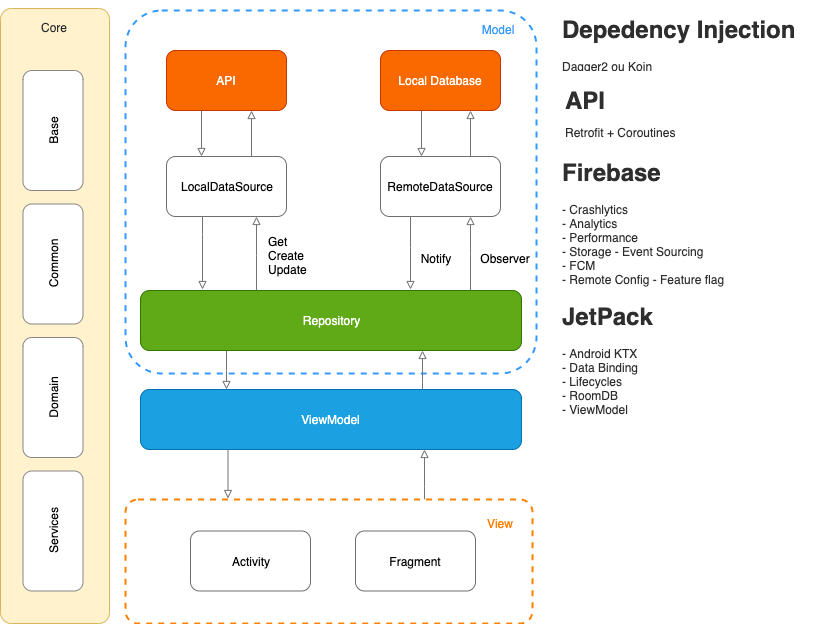

MVVM start
==

### Requisitos

- Feature by package
- Kotlin
- Android JetPack
- DI com Dagger2 ou Koin
- Coroutines
- Retrofit

### SOLID

### Model

### View

### ViewModel

### Offline first

### Firebase
